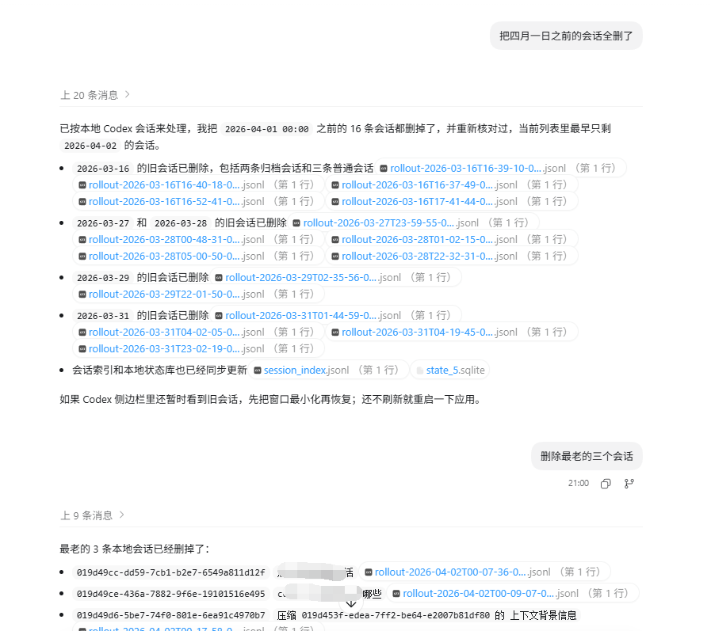
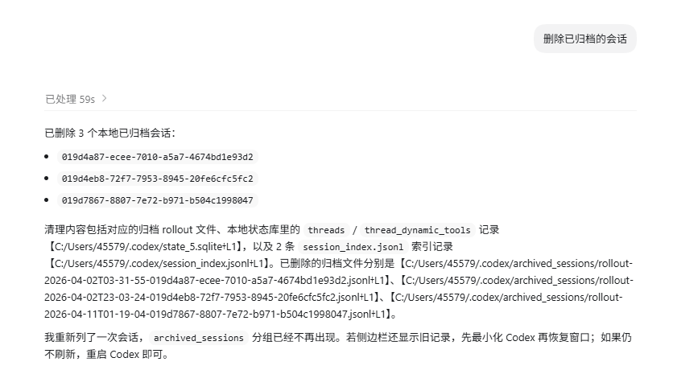

简体中文 | [English](./README.en.md)

# delete-codex-local-session

一个用于列出、检查并按会话 ID 删除本地 Codex 会话的 skill。

这个 skill 只用于本地 Codex 会话管理和清理，不会删除云端或账号层面的聊天记录。

## 功能

- 按本地会话文件夹分组列出 `session_id` 和会话标题
- 先预览一个或多个会话 ID 在本地命中了哪些文件和数据库记录
- 删除 `sessions/` 和 `archived_sessions/` 下对应的 transcript 文件
- 删除 `session_index.jsonl` 中对应的索引项
- 删除 `state*.sqlite` 中 `threads`、`stage1_outputs`、`thread_dynamic_tools`、`thread_spawn_edges` 对应的记录
- 将 `state*.sqlite` 中 `agent_job_items.assigned_thread_id` 对应的引用清空为 `NULL`
- 删除 `logs*.sqlite` 中对应的日志记录
- 删除 `generated_images/<session-id>/` 下对应的图片目录
- 删除 `.codex-global-state.json` 中与该会话 ID 精确匹配的键或值

## 安全机制

- 默认只做预览
- 只有加上 `--apply` 才会真正删除
- 在 Codex 对话中使用 skill 删除时，默认会带上 `--vacuum`，用于删除后压缩被修改的 SQLite 数据库
- 在命令行直接运行脚本时，只有显式加上 `--vacuum` 才会压缩
- `--keep-global-state` 可用于保留 `.codex-global-state.json` 不变

## 免责声明

- 这个 skill 只处理本地 `CODEX_HOME` 或 `~/.codex` 下的 Codex 数据，不会删除云端、账号侧或服务端保存的聊天记录
- 删除操作具有破坏性，使用前应先运行预览模式，并在需要时自行备份相关本地数据
- Codex 的本地目录结构、SQLite 表结构和内部存储方式未来可能变化；在不同版本上使用时应自行确认结果
- 你需要自行负责对本地会话数据的导出、删除、备份和分享行为，并确保符合你的设备使用规范、团队要求或相关法律义务

## 安装方法

把这个仓库的内容放到你的 Codex skills 目录中，目录应为：

```text
~/.codex/skills/delete-codex-local-session/
```

在 Windows 上通常对应：

```text
C:\Users\<你的用户名>\.codex\skills\delete-codex-local-session\
```

最终目录结构应当类似：

```text
delete-codex-local-session/
├── SKILL.md
├── agents/
│   └── openai.yaml
└── scripts/
    ├── list_codex_sessions_by_folder.py
    └── delete_codex_local_session.py
```

## 在 Codex 对话中使用

你可以显式点名这个 skill：

```text
用 $delete-codex-local-session 列出本地会话 id 和标题
用 $delete-codex-local-session 预览本地会话 019d...
用 $delete-codex-local-session 删除本地会话 019d...
```

默认约定：

- 当你说“对话列表”“会话列表”“对话 id 列表”时，默认直接返回列举脚本的原始输出结果
- 只有你明确说“只要 id”时，才按纯 ID 列表理解
- 当你给出明确会话 ID 并要求“删除这些 ID”时，视为已经确认删除，不再额外二次确认
- 多个 ID 使用一条批量删除命令；大量 ID 可使用 `--quiet` 只输出汇总
- 当你在 Codex 对话中说“删除本地会话”时，默认执行删除并带上 `--vacuum`；只有明确说“不压缩”时才省略压缩

## 使用示例

下面两张截图展示了在 Codex 对话中用自然语言清理本地会话的典型方式。

删除指定日期之前的本地会话：



删除已归档的本地会话：



## 在命令行中使用

按文件夹列出本地会话：

```powershell
python scripts/list_codex_sessions_by_folder.py
```

列出时同时显示完整路径：

```powershell
python scripts/list_codex_sessions_by_folder.py --show-paths
```

列出时包含数据库里仍有记录、但 transcript 文件已丢失的会话：

```powershell
python scripts/list_codex_sessions_by_folder.py --include-missing
```

只预览，不删除：

```powershell
python scripts/delete_codex_local_session.py <session-id>
```

批量预览多个会话：

```powershell
python scripts/delete_codex_local_session.py <session-id> <session-id> ...
```

真正删除本地会话：

```powershell
python scripts/delete_codex_local_session.py <session-id> --apply
```

批量删除多个本地会话，并只输出汇总：

```powershell
python scripts/delete_codex_local_session.py <session-id> <session-id> ... --apply --vacuum --quiet
```

删除并顺便压缩 SQLite 数据库：

```powershell
python scripts/delete_codex_local_session.py <session-id> --apply --vacuum
```

删除时保留 `.codex-global-state.json` 不变：

```powershell
python scripts/delete_codex_local_session.py <session-id> --apply --keep-global-state
```

## 使用建议

- 条件允许时，先关闭 Codex app 再删除会话
- 如果删除后界面里仍然显示旧线程，先把 Codex app 最小化到任务栏，再恢复窗口，这通常会触发侧边栏刷新
- 如果最小化再恢复后仍未刷新，再重启 Codex app
- 每次删除前都建议先运行一次预览模式

## 运行要求

- Python 3
- 自带脚本不依赖第三方 Python 包

## 仓库内容

- `SKILL.md`：skill 的触发说明与使用流程
- `agents/openai.yaml`：UI 展示相关元数据
- `docs/images/`：README 使用示例截图
- `scripts/list_codex_sessions_by_folder.py`：按文件夹列出本地会话 ID 和标题
- `scripts/delete_codex_local_session.py`：实际执行清理的脚本

## 限制

- 仅清理本地数据，不会删除服务端或账号层面的聊天记录
- 即使本地已删除，Codex 界面也可能因为缓存暂时显示旧线程；通常先最小化并恢复窗口即可触发刷新，但仍不保证每次都立即生效
